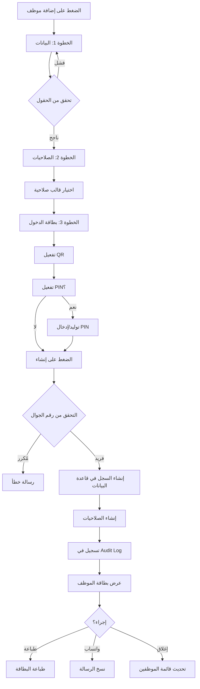

# دليل نظام إضافة الموظفين - نموذج متقدم بـ 3 خطوات

## 📍 الموقع داخل النظام

```
لوحة الإدارة العليا (HQ)
  → تبويب: إدارة الفريق والصلاحيات
    → قسم: إدارة الموظفين
      → زر: ➕ إضافة موظف
```

### المسار:
- الصفحة الرئيسية: `/hq`
- التبويب: إدارة الفريق والصلاحيات (داخل نفس الصفحة)
- النموذج: Modal/Drawer (لا يفتح صفحة جديدة)

---

## ✨ الميزات الرئيسية

### 🎯 نموذج بـ 3 خطوات واضحة

#### الخطوة 1️⃣: بيانات الموظف
**حقول إلزامية:**
- ✅ الاسم الكامل
- ✅ رقم الجوال (يبدأ بـ +966 - منع التكرار تلقائياً)
- ✅ المسمى الوظيفي
- ✅ القسم:
  - الإدارة العليا (HQ)
  - مزاد الشركات (B2B)
  - استثمار أشجار المزارع (B2F)

**حقول اختيارية:**
- المدير المباشر (يتبع لـ)

---

#### الخطوة 2️⃣: الصلاحيات (نظام القوالب)

**قوالب الصلاحيات الجاهزة:**
1. **مدير عام** - صلاحية مطلقة على كامل النظام
2. **مدير قسم** - إدارة القسم والموظفين
3. **موظف إداري** - صلاحيات إدارية محدودة
4. **مدير مزرعة** - إدارة المزارع والعمليات
5. **مشرف تشغيلي** - إشراف على العمليات الميدانية
6. **خدمة مستثمر** - متابعة المستثمرين والطلبات
7. **مالية 2** - مراجعة واعتماد المدفوعات

**مفاتيح تخصيص إضافية (3 خيارات):**
- ✅ إنشاء مهام
- ✅ اعتماد مهام/إثباتات
- ✅ إرسال تقارير للإدارة العليا

---

#### الخطوة 3️⃣: بطاقة الدخول

**تفعيل الباركود:**
- ☑️ افتراضي: مُفعّل
- يتم توليد QR Token تلقائياً

**رمز PIN:**
- ☑️ يتطلب PIN (للمدراء والمشرفين)
- خيارات:
  - توليد تلقائي (4 أرقام عشوائية)
  - تعيين يدوي (4 أرقام)

**جلسة الإدارة:**
- تبقى فعالة ولا تنتهي إلا بـ:
  - ✅ تسجيل الخروج يدوياً
  - ✅ 30 دقيقة من عدم النشاط (Idle)

---

## 🎴 بطاقة الموظف (بعد الإنشاء)

عند الضغط على "إنشاء الموظف"، يتم عرض بطاقة دخول جاهزة للطباعة:

### محتويات البطاقة:
```
┌────────────────────────────────┐
│     [صورة رمزية دائرية]        │
│                                │
│      أحمد محمد العلي           │
│      مدير عمليات              │
│    [استثمار أشجار المزارع]    │
│                                │
│   ┌──────────────────────┐    │
│   │                      │    │
│   │     [QR Code]        │    │
│   │                      │    │
│   └──────────────────────┘    │
│   STAFF_1704283920_XYZ123     │
│                                │
│  ┌─────────────┬──────────┐   │
│  │ الرقم الإداري │  رمز PIN │   │
│  │   A-00123   │   5847   │   │
│  └─────────────┴──────────┘   │
│                                │
│  ✅ تم إنشاء الموظف بنجاح     │
└────────────────────────────────┘
```

### أزرار الإجراءات:
1. 🖨️ **طباعة البطاقة** - طباعة مباشرة
2. 💬 **نسخ رسالة واتساب** - رسالة جاهزة للإرسال للموظف

**مثال على الرسالة:**
```
مرحباً أحمد محمد العلي،

تم إضافتك كموظف في المنصة

الرقم الإداري: A-00123
المسمى: مدير عمليات
القسم: استثمار أشجار المزارع

رمز PIN: 5847

يرجى الاحتفاظ ببطاقة الدخول الخاصة بك.
```

---

## 🔐 الأمان والحماية

### 1. منع التكرار
- ✅ رقم الجوال فريد (لا يمكن تسجيل نفس الرقم مرتين)
- ✅ رمز الموظف (Staff Code) فريد تلقائياً

### 2. التحقق من البيانات
- ✅ رقم الجوال يجب أن يبدأ بـ +966
- ✅ جميع الحقول الإلزامية يتم التحقق منها قبل الانتقال للخطوة التالية

### 3. الصلاحيات
- ✅ فقط الإدارة العليا يمكنها إضافة موظفين
- ✅ يتم تسجيل كل عملية إضافة في سجل التدقيق (Audit Log)

---

## 🗄️ قاعدة البيانات

### الجداول المستخدمة:

#### 1. `platform_staff`
الحقول الجديدة المضافة:
- `staff_code` (text, unique) - الرقم الإداري
- `full_name` (text) - الاسم الكامل
- `phone_number` (text, unique) - رقم الجوال
- `job_title` (text) - المسمى الوظيفي
- `reports_to` (text) - المدير المباشر
- `qr_code` (text) - رمز الباركود
- `requires_pin` (boolean) - يتطلب PIN
- `pin_code` (text) - رمز PIN

#### 2. `staff_permissions` (جديد)
- `staff_id` (uuid) - معرف الموظف
- `permission_template` (text) - قالب الصلاحية المختار
- `can_create_tasks` (boolean) - إنشاء مهام
- `can_approve_tasks` (boolean) - اعتماد مهام
- `can_send_reports` (boolean) - إرسال تقارير

#### 3. `platform_audit_logs`
تسجيل تلقائي لكل عملية إضافة موظف:
- نوع الإجراء: `staff_created`
- التفاصيل: الاسم، القسم، الصلاحية

---

## 🎨 التصميم والواجهة

### الألوان:
- **Primary**: أخضر زمردي (Emerald) - للنجاح والإيجابية
- **Secondary**: تركوازي (Teal) - للتدرجات
- **Background**: رمادي داكن (Slate 900-800) - خلفية راقية

### شريط التقدم:
```
الخطوة 1 من 3    [البيانات]
▓▓▓▓▓▓▓▓▓▓ ░░░░░░░░░░ ░░░░░░░░░░
```

### الأيقونات:
- 👤 المستخدم
- 📱 الجوال
- 💼 المسمى الوظيفي
- 🏢 القسم
- 🛡️ الصلاحيات
- 📷 الباركود
- 🔑 PIN
- ⏰ الجلسة

---

## 🔄 سير العمل (Workflow)



---

## 🧪 اختبار التسليم

### ✅ خطوات الاختبار الإلزامية:

#### 1. إنشاء موظف جديد
```
الاسم: محمد أحمد السعيد
الجوال: +966501234567
المسمى: مشرف عمليات
القسم: B2F
الصلاحية: operations_supervisor
PIN: 1234
```

#### 2. التحقق من البطاقة
- ✅ الاسم ظاهر بشكل صحيح
- ✅ QR Code تم إنشاؤه
- ✅ Staff Code فريد (مثال: A-00001)
- ✅ رمز PIN ظاهر (إذا تم تفعيله)

#### 3. محاولة تكرار الرقم
- ✅ إنشاء موظف آخر بنفس رقم الجوال
- ✅ يجب أن تظهر رسالة خطأ: "رقم الجوال مسجل مسبقاً"

#### 4. التحقق من قاعدة البيانات
```sql
-- التحقق من الموظف الجديد
SELECT * FROM platform_staff
WHERE phone_number = '+966501234567';

-- التحقق من الصلاحيات
SELECT * FROM staff_permissions
WHERE staff_id = (
  SELECT id FROM platform_staff
  WHERE phone_number = '+966501234567'
);

-- التحقق من سجل التدقيق
SELECT * FROM platform_audit_logs
WHERE action_type = 'staff_created'
ORDER BY created_at DESC
LIMIT 1;
```

#### 5. اختبار الدخول (محاكاة)
- ✅ مسح الباركود → التوجيه للوحة القسم الصحيحة
- ✅ إدخال PIN → التحقق من الرمز
- ✅ الجلسة تبقى فعالة

---

## 📂 الملفات المعنية

### Frontend (React):
```
src/components/platform/
  ├── AddEmployeeModal.tsx          (النموذج الرئيسي - 3 خطوات)
  └── team/
      └── StaffManagementSection.tsx (إدارة الموظفين)
```

### Backend (Supabase):
```
supabase/migrations/
  └── 20260103120000_add_staff_code_and_permissions_system.sql
```

### الجداول:
- `platform_staff` (محدّث)
- `staff_permissions` (جديد)
- `platform_audit_logs` (مستخدم)

---

## 🚀 التوجيه بعد الدخول

عند دخول الموظف باستخدام QR + PIN:

```javascript
if (department === 'hq') {
  navigate('/hq');
} else if (department === 'b2b') {
  navigate('/admin/auctions');  // أو /admin/b2b
} else if (department === 'b2f') {
  navigate('/admin/b2f');
}
```

**ملاحظة مهمة:**
- ✅ لا يتم إنشاء لوحات تحكم جديدة
- ✅ التوجيه لللوحات الموجودة حسب القسم
- ✅ الجلسة تبقى فعالة عند التنقل

---

## 📊 الإحصائيات والمراقبة

### في قسم إدارة الموظفين:
- 👥 إجمالي الموظفين
- ✅ الموظفين النشطين
- ❌ الموظفين المعطلين
- 📷 الموظفين بباركود مفعّل
- 🔑 الموظفين بـ PIN مفعّل

### الفلاتر المتاحة:
- 🔍 البحث (الاسم، الجوال، البريد)
- 🏢 القسم (HQ, B2B, B2F)
- 🛡️ الصلاحية
- ✅ الحالة (نشط / معطل)

---

## 🎯 الأهداف المحققة

- ✅ نموذج بـ 3 خطوات واضحة ومنظمة
- ✅ قوالب صلاحيات جاهزة (بدلاً من checkboxes كثيرة)
- ✅ منع تكرار رقم الجوال تلقائياً
- ✅ توليد Staff Code فريد تلقائياً
- ✅ نظام QR + PIN متكامل
- ✅ بطاقة موظف جاهزة للطباعة
- ✅ رسالة واتساب جاهزة للنسخ
- ✅ جلسة إدارة تبقى فعالة (30 دقيقة Idle)
- ✅ تسجيل تلقائي في Audit Log
- ✅ التوجيه التلقائي حسب القسم
- ✅ لا توجد لوحات جديدة (استخدام اللوحات الموجودة)

---

## 🔮 الخطوات القادمة (اختياري)

1. **تحسين البطاقة:**
   - إضافة صورة الموظف
   - طباعة بتقنية QR Code حقيقية (مكتبة qrcode.react)

2. **التكامل مع نظام الحضور:**
   - تسجيل وقت الدخول/الخروج
   - تقارير الحضور

3. **إشعارات تلقائية:**
   - إشعار عند إضافة موظف جديد
   - تنبيه انتهاء صلاحية PIN

4. **تقارير الموظفين:**
   - تقرير شامل بالموظفين
   - تصدير Excel/PDF

---

## 📝 ملاحظات مهمة

1. **لا يتم عرض QR Token الكامل في الواجهة** - فقط في البطاقة للأمان
2. **PIN يُخزن بشكل آمن** - يمكن تشفيره لاحقاً
3. **الجلسة تُدار بواسطة adminSessionManager** - موجود مسبقاً
4. **التوجيه التلقائي** - حسب القسم المُحدد
5. **لا توجد صفحات جديدة** - كل شيء Modal/Drawer

---

## ✅ الخلاصة

تم تطوير نظام متكامل لإضافة الموظفين بـ **3 خطوات واضحة**:
1. **البيانات** - الاسم، الجوال، المسمى، القسم
2. **الصلاحيات** - قوالب جاهزة + 3 مفاتيح تخصيص
3. **بطاقة الدخول** - QR + PIN + جلسة دائمة

**النتيجة:** بطاقة موظف جاهزة للطباعة + رسالة واتساب جاهزة + تسجيل تلقائي في النظام.

**الموقع:** `/hq` → تبويب "إدارة الفريق والصلاحيات" → زر "إضافة موظف"

---

🎉 **النظام جاهز للاستخدام!**
