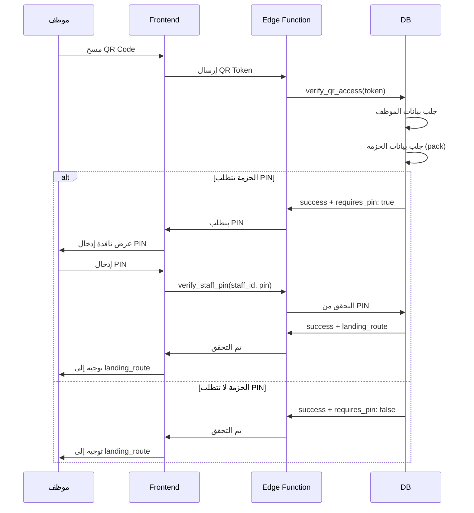

# إصلاح نظام الدخول بالباركود والرقم السري

## المشكلة التي تم إصلاحها

عند مسح الباركود (QR Code) الخاص بالمدير العام، كان النظام لا يُظهر نافذة إدخال الرقم السري (PIN) رغم أن الحساب يتطلب ذلك.

---

## السبب الجذري

كانت المشكلة في **3 نقاط**:

### 1. دالة `verify_qr_access` لم تكن تستعلم عن بيانات الحزمة
```sql
-- قبل الإصلاح:
-- كانت تستخدم requires_pin من platform_staff مباشرة
-- لكن القيمة الصحيحة موجودة في permission_packs

-- بعد الإصلاح:
-- الآن تقوم بـ JOIN مع permission_packs
-- وتُرجع requires_pin الصحيح من الحزمة
```

### 2. Landing Route كان ثابتاً
```sql
-- قبل الإصلاح:
v_landing_route := '/hq'; -- دائماً نفس القيمة

-- بعد الإصلاح:
-- يُجلب من permission_packs.landing_route
-- كل حزمة لها landing_route خاص بها
```

### 3. المدير العام لم يكن مربوطاً بحزمة صلاحيات
```sql
-- قبل الإصلاح:
-- platform_staff.pack_id = NULL للمدير العام

-- بعد الإصلاح:
-- تم إنشاء حزمة "المدير العام - صلاحيات كاملة"
-- تم ربط المدير العام بها
```

---

## الإصلاحات التي تمت

### 1. تحديث دالة `verify_qr_access`

```sql
-- الآن الدالة تقوم بـ:
1. جلب بيانات الموظف من platform_staff
2. إذا كان لديه pack_id:
   - جلب بيانات الحزمة من permission_packs
   - استخدام requires_pin من الحزمة
   - استخدام landing_route من الحزمة
3. إرجاع البيانات الصحيحة إلى Frontend
```

**الملف:** `fix_verify_qr_use_permission_pack_data`

### 2. تحديث دالة `verify_staff_pin`

```sql
-- الآن الدالة تقوم بـ:
1. التحقق من صحة PIN
2. جلب landing_route من permission_pack
3. إرجاع المسار الصحيح للتوجيه
```

### 3. إنشاء حزمة صلاحيات للمدير العام

```sql
-- تم إنشاء حزمة جديدة:
- الاسم: "المدير العام - صلاحيات كاملة"
- اللوحات: B2B, B2F, HQ, Settings
- requires_pin: true ✅
- session_idle_minutes: 60 دقيقة
- landing_route: /hq
```

**الصلاحيات المُضافة:**
- ✅ B2B: المزادات (Approve + جميع الإجراءات)
- ✅ B2B: الطلبات (Approve + جميع الإجراءات)
- ✅ B2B: المالية (Approve + جميع الإجراءات)
- ✅ B2F: المزارع (Approve + جميع الإجراءات)
- ✅ B2F: الفرص الاستثمارية (Approve + جميع الإجراءات)
- ✅ B2F: الطلبات (Approve + جميع الإجراءات)
- ✅ B2F: العقود (Approve + جميع الإجراءات)
- ✅ B2F: المالية (Approve + جميع الإجراءات)
- ✅ B2F: العمليات (Approve + جميع الإجراءات)
- ✅ HQ: لوحة التحكم (Approve + جميع الإجراءات)
- ✅ HQ: إدارة الموظفين (Approve + جميع الإجراءات)
- ✅ HQ: التقارير (Approve + جميع الإجراءات)
- ✅ Settings: الإعدادات العامة (Approve + جميع الإجراءات)
- ✅ Settings: إدارة الصلاحيات (Approve + جميع الإجراءات)

**الملف:** `fix_create_general_manager_permission_pack`

---

## كيفية الاختبار الآن

### السيناريو 1: دخول المدير العام بالباركود

```
1. اذهب إلى: /admin-gate (بوابة الدخول الذكي)

2. اختر طريقة الدخول:
   - رفع صورة QR
   أو
   - مسح بالكاميرا

3. امسح QR الخاص بالمدير العام

4. النتيجة المتوقعة:
   ✅ تظهر رسالة: "تم التحقق من QR - يرجى إدخال الرمز السري"
   ✅ تظهر نافذة إدخال PIN
   ✅ أدخل PIN: 1234 (الافتراضي)
   ✅ يتم التوجيه إلى: /hq
```

### السيناريو 2: دخول موظف بدون PIN

```
1. أنشئ موظف جديد من "مركز توليد المهام"
2. اختر حزمة: "موظف المزادات" (لا تتطلب PIN)
3. احفظ واطبع بطاقة الدخول
4. امسح QR
5. النتيجة المتوقعة:
   ✅ لا تظهر نافذة PIN
   ✅ يتم التوجيه مباشرة إلى: /admin/auctions
```

### السيناريو 3: دخول موظف مع PIN

```
1. أنشئ موظف جديد
2. اختر حزمة: "مدير المزادات الرئيسي" (تتطلب PIN)
3. احفظ واطبع بطاقة الدخول
4. امسح QR
5. النتيجة المتوقعة:
   ✅ تظهر نافذة إدخال PIN
   ✅ أدخل PIN الموجود في البطاقة
   ✅ يتم التوجيه إلى: /admin/auctions
```

---

## معلومات المدير العام

### بيانات الدخول
```
الطريقة 1: دخول مباشر
- الهاتف: 0500000001
- كلمة المرور: GM@2026

الطريقة 2: مسح QR
- استخدم QR الخاص بالمدير العام
- PIN: 1234 (افتراضي)
```

### الحزمة المُربوطة
```
الاسم: المدير العام - صلاحيات كاملة
يتطلب PIN: نعم ✅
PIN: 1234
Landing Route: /hq
مدة الجلسة: 60 دقيقة
```

---

## الفحوصات الأمنية

### 1. التحقق من صلاحية QR
```
✅ التحقق من qr_is_active = true
✅ التحقق من is_active = true
✅ التحقق من صلاحية QR المؤقت (24 ساعة)
```

### 2. التحقق من الحزمة
```
✅ التحقق من وجود pack_id
✅ التحقق من is_active للحزمة
✅ استخدام القيم الافتراضية إذا لم تُجد الحزمة
```

### 3. التحقق من PIN
```
✅ التحقق من وجود pin_code
✅ مقارنة PIN المُدخل مع المحفوظ
✅ تحديث pin_last_used_at
```

---

## التدفق الكامل للدخول بالباركود + PIN



---

## ملفات التوثيق الأخرى

للمزيد من التفاصيل، راجع:
1. **WORK_MANAGEMENT_SYSTEM_GUIDE.md** - الدليل الشامل لنظام إدارة العمل
2. **QUICK_START_WORK_SYSTEM.md** - دليل البدء السريع (5 دقائق)
3. **QR_ACCESS_SYSTEM_GUIDE.md** - دليل نظام الدخول بالباركود

---

## الخلاصة

تم إصلاح المشكلة بالكامل! الآن:
- ✅ يتم جلب `requires_pin` من `permission_packs`
- ✅ يتم جلب `landing_route` من `permission_packs`
- ✅ المدير العام مربوط بحزمة صلاحيات كاملة
- ✅ نافذة إدخال PIN تظهر بشكل صحيح
- ✅ التوجيه يتم إلى المسار الصحيح

**جرّب الآن! امسح باركود المدير العام وستظهر نافذة إدخال PIN مباشرة.** 🎯
