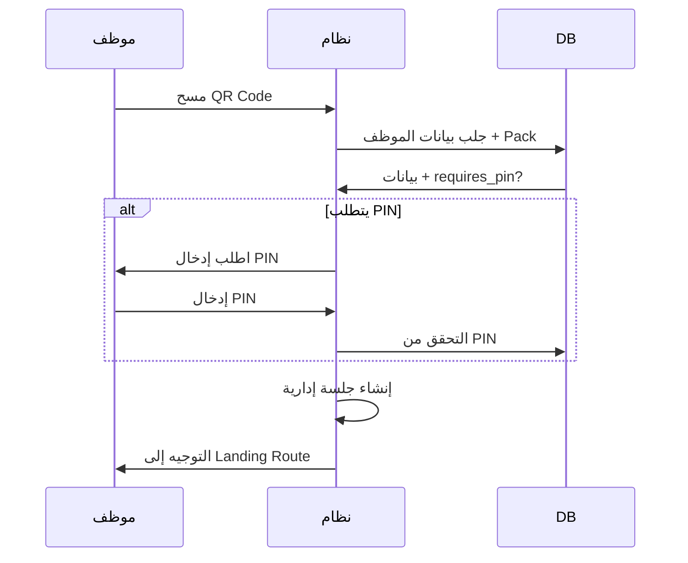

# دليل نظام إدارة العمل والصلاحيات المتقدم

## نظرة عامة

تم إنشاء نظام متكامل لإدارة الموظفين والصلاحيات والمهام في لوحة الإدارة العليا (HQ Dashboard). يحتوي النظام على 4 أقسام رئيسية:

1. **حزم الصلاحيات (Permission Packs)**
2. **قوالب المهام (Task Templates)**
3. **إدارة الموظفين (Staff Management)**
4. **الفرق والهيكل الإداري (Teams Structure)**

---

## الوصول إلى النظام

### المسار
1. سجل دخول كمدير عام (General Manager) أو كمالك النظام
2. اذهب إلى لوحة الإدارة العليا (HQ Dashboard)
3. ستجد تبويب جديد: **"مركز توليد المهام والصلاحيات"**

### الصلاحيات المطلوبة
- يجب أن يكون المستخدم من نوع: `platform_owner`, `super_admin`, أو `general_manager`
- يجب أن يكون الحساب نشطاً في جدول `platform_staff`

---

## 1. حزم الصلاحيات (Permission Packs)

### الوصف
حزم صلاحيات قابلة للتخصيص تُستخدم لتحديد ما يمكن للموظف الوصول إليه.

### الميزات الرئيسية

#### أ) اختيار اللوحات المستهدفة
- **B2B** - المزادات
- **B2F** - استثمار المزارع
- **HQ** - لوحة الإدارة العليا
- **Settings** - الإعدادات

يمكن اختيار لوحة واحدة أو أكثر.

#### ب) الصلاحيات التفصيلية
لكل قسم داخل اللوحة، يمكن تحديد:

**مستويات الصلاحيات:**
- **View** - عرض فقط
- **Manage** - إدارة (إنشاء، تعديل)
- **Approve** - اعتماد (موافقة على العمليات)

**الإجراءات (Actions):**
- `create` - إنشاء جديد
- `edit` - تعديل
- `delete` - حذف
- `export` - تصدير البيانات

#### ج) إعدادات الدخول
- **QR Code** - إلزامي دائماً لجميع الحزم
- **PIN Code** - يُولد تلقائياً في الحالات التالية:
  - إذا كانت الحزمة تحتوي على صلاحية `Approve`
  - إذا كانت الحزمة تحتوي على إجراء `delete`
  - إذا كانت الحزمة تتضمن أقسام حساسة: `Finance`, `Contracts`, `Payments`
- **Session Duration** - مدة الجلسة (افتراضي: 30 دقيقة)
- **Landing Route** - الصفحة التي يُوجه إليها الموظف بعد الدخول

#### د) حزم جاهزة (تم إنشاؤها مسبقاً)
1. **مدير المزادات الرئيسي** - صلاحيات كاملة للمزادات
2. **مدير المزارع** - صلاحيات كاملة للمزارع
3. **موظف المزادات** - صلاحيات عرض وإدارة
4. **موظف خدمة العملاء** - صلاحيات عرض
5. **محاسب** - صلاحيات مالية

### كيفية الاستخدام

#### إنشاء حزمة جديدة:
```
1. انقر على "إنشاء حزمة جديدة"
2. أدخل اسم الحزمة (مثال: "مدير المحتوى")
3. اكتب وصف مختصر
4. اختر اللوحات المستهدفة
5. حدد Landing Route
6. حدد مدة الجلسة
7. فعّل PIN إذا لزم الأمر
8. أضف الصلاحيات التفصيلية:
   - اختر اللوحة
   - اختر القسم
   - حدد المستوى (View/Manage/Approve)
   - اختر الإجراءات
9. احفظ الحزمة
```

---

## 2. قوالب المهام (Task Templates)

### الوصف
قوالب قابلة لإعادة الاستخدام لإنشاء مهام موحدة للموظفين.

### الميزات

#### أ) معلومات أساسية
- **اسم المهمة**
- **الوصف**
- **اللوحة المرتبطة** (B2B/B2F/Operations/General)
- **القسم** (اختياري)
- **الأولوية** (منخفضة/متوسطة/عالية/عاجلة)
- **المدة المتوقعة** (بالدقائق)

#### ب) متطلبات التنفيذ
- **يتطلب إثبات بالصور** - يجب على الموظف تحميل صور كإثبات
- **يتطلب اعتماد** - يجب موافقة المدير
- **إرسال تقرير توثيق** - يُرسل تقرير بعد الاعتماد

#### ج) قائمة التحقق (Checklist)
يمكن إضافة عناصر متعددة يجب على الموظف إكمالها.

#### د) قوالب جاهزة (تم إنشاؤها مسبقاً)
1. **مراجعة مزاد جديد** - High Priority
2. **مراجعة طلب استثمار** - Urgent
3. **تحديث بيانات مزرعة** - Medium
4. **الرد على استفسار عميل** - Medium
5. **مراجعة عملية موسمية** - High

### كيفية الاستخدام

#### إنشاء قالب جديد:
```
1. انقر على "إنشاء قالب جديد"
2. أدخل اسم المهمة
3. اكتب الوصف التفصيلي
4. اختر اللوحة والقسم
5. حدد الأولوية والمدة المتوقعة
6. فعّل المتطلبات (إثبات/اعتماد/تقرير)
7. أضف عناصر قائمة التحقق
8. احفظ القالب
```

---

## 3. إدارة الموظفين (Staff Management)

### الوصف
إضافة وإدارة الموظفين مع توليد بطاقات دخول تلقائية.

### الميزات

#### أ) معلومات الموظف
- **الاسم الكامل**
- **رقم الهاتف**
- **المسمى الوظيفي**
- **القسم**

#### ب) حزمة الصلاحيات
- اختيار حزمة من الحزم المُنشأة مسبقاً
- يتم توليد QR تلقائياً
- يتم توليد PIN تلقائياً (إذا كان مطلوباً)

#### ج) الهيكل الإداري
- **المدير المباشر (reports_to)** - اختياري
- يُستخدم في بناء الشجرة الإدارية

#### د) بطاقة الدخول
بعد إنشاء الموظف، يمكن:
- **عرض بطاقة الدخول** - تحتوي على QR + PIN
- **طباعة البطاقة** - قابلة للطباعة مباشرة
- البطاقة تحتوي على:
  - QR Code للمسح
  - رمز PIN (إذا كان مطلوباً)
  - معلومات الموظف
  - تاريخ الإنشاء

### كيفية الاستخدام

#### إضافة موظف جديد:
```
1. انقر على "إضافة موظف"
2. أدخل الاسم الكامل
3. أدخل رقم الهاتف
4. أدخل المسمى الوظيفي (مثال: "مدير المحتوى")
5. أدخل القسم (مثال: "b2b")
6. اختر حزمة الصلاحيات
7. اختر المدير المباشر (اختياري)
8. احفظ الموظف
9. انقر على "بطاقة الدخول" لعرضها
10. اطبع البطاقة وسلمها للموظف
```

---

## 4. الفرق والهيكل الإداري (Teams Structure)

### الوصف
إدارة فرق العمل وعرض الهيكل الإداري الشجري.

### الميزات

#### أ) فرق العمل
- **إنشاء فريق** - مع اسم ووصف
- **تعيين قائد الفريق**
- **إضافة أعضاء** - من الموظفين المُضافين
- **تحديد دور العضو** في الفريق (اختياري)

#### ب) الهيكل الإداري
- **عرض شجري تلقائي** للموظفين
- يعتمد على علاقة `reports_to`
- عرض التبعية الإدارية بشكل مرئي
- قابل للتوسع والطي

#### ج) فرق جاهزة (تم إنشاؤها مسبقاً)
1. **فريق المزادات** - b2b department
2. **فريق المزارع والاستثمار** - b2f department
3. **فريق خدمة العملاء** - support department

### كيفية الاستخدام

#### إنشاء فريق جديد:
```
1. انقر على "إنشاء فريق"
2. أدخل اسم الفريق
3. اكتب الوصف
4. أدخل القسم
5. اختر قائد الفريق
6. احفظ الفريق
7. انقر على الفريق لتوسيعه
8. انقر على "إضافة عضو"
9. اختر الموظف
10. حدد دوره في الفريق (اختياري)
11. احفظ
```

---

## آلية الدخول بالباركود (QR System)

### عملية الدخول



### تفاصيل الجلسة
- **مدة الجلسة**: 30 دقيقة Idle (قابلة للتخصيص)
- **الإنهاء**: تنتهي بالـ Logout أو بعد انتهاء المدة
- **التوجيه**: يتم التوجيه إلى Landing Route المُحدد في الحزمة
- **ممنوع**: التوجيه إلى "/" (الصفحة الرئيسية)

---

## قاعدة البيانات

### الجداول الجديدة

#### 1. permission_packs
```sql
- id (uuid)
- name (text)
- description (text)
- target_boards (text[])
- requires_pin (boolean)
- session_idle_minutes (integer)
- landing_route (text)
- is_active (boolean)
```

#### 2. pack_permissions
```sql
- id (uuid)
- pack_id (uuid)
- board (text)
- section (text)
- access_level (text) -- view/manage/approve
- actions (text[])
```

#### 3. task_templates
```sql
- id (uuid)
- name (text)
- description (text)
- board (text)
- section (text)
- requires_proof (boolean)
- requires_approval (boolean)
- send_report_on_approval (boolean)
- checklist_items (text[])
- estimated_duration_minutes (integer)
- priority (text)
```

#### 4. staff_tasks
```sql
- id (uuid)
- template_id (uuid)
- staff_id (uuid)
- assigned_by (uuid)
- status (text)
- requires_proof (boolean)
- requires_approval (boolean)
```

#### 5. task_proofs
```sql
- id (uuid)
- task_id (uuid)
- image_url (text)
- description (text)
```

#### 6. staff_teams
```sql
- id (uuid)
- name (text)
- description (text)
- team_leader_id (uuid)
- department (text)
```

#### 7. team_members
```sql
- id (uuid)
- team_id (uuid)
- staff_id (uuid)
- role_in_team (text)
```

### التحديثات على الجداول الموجودة

#### platform_staff
- إضافة `pack_id` - ربط بحزمة الصلاحيات
- إضافة `reports_to_staff_id` - للهيكل الإداري

---

## دوال مساعدة (Helper Functions)

### 1. is_pin_required_for_pack(pack_id)
يتحقق تلقائياً إذا كانت الحزمة تحتاج PIN بناءً على:
- إعداد الحزمة
- وجود صلاحيات حساسة
- وجود أقسام مالية

### 2. get_staff_hierarchy(staff_id)
تُرجع الهيكل الإداري الكامل للموظف.

### 3. create_staff_member(...)
دالة مساعدة لإنشاء موظف بسهولة مع توليد QR + PIN تلقائياً.

---

## نصائح وأفضل الممارسات

### 1. إنشاء الحزم
- **كن محدداً**: أنشئ حزم متخصصة لكل دور
- **لا تبالغ**: لا تمنح صلاحيات أكثر من اللازم
- **استخدم Approve بحذر**: فقط للأدوار التي تتطلب موافقات

### 2. إدارة الموظفين
- **حدد المدير المباشر دائماً**: لبناء هيكل إداري واضح
- **احتفظ ببطاقات الدخول**: في مكان آمن
- **غيّر PIN عند الضرورة**: إذا تم اختراقه

### 3. قوالب المهام
- **استخدم الأولويات بحكمة**: العاجلة للمهام الحرجة فقط
- **أضف قوائم تحقق واضحة**: تساعد الموظفين على الإنجاز
- **حدد مدة واقعية**: بناءً على التجربة الفعلية

### 4. الفرق
- **أنشئ فرقاً حسب القسم**: لسهولة الإدارة
- **عيّن قادة أكفاء**: لمتابعة العمل
- **حدّث الفرق بانتظام**: عند انضمام/مغادرة موظفين

---

## استكشاف الأخطاء وحلها

### خطأ: "حدث خطأ أثناء الحفظ"

**الأسباب المحتملة:**
1. المستخدم غير مُسجل كمدير في `platform_staff`
2. الحساب غير نشط (`is_active = false`)
3. مشكلة في الـ RLS policies

**الحل:**
```sql
-- تحقق من صلاحياتك
SELECT * FROM platform_staff
WHERE user_id = auth.uid();

-- يجب أن يكون role أحد هذه القيم:
-- platform_owner, super_admin, general_manager

-- يجب أن يكون is_active = true
```

### خطأ: لا تظهر البيانات التجريبية

**الحل:**
```sql
-- تحقق من وجود البيانات
SELECT * FROM permission_packs;
SELECT * FROM task_templates;
SELECT * FROM staff_teams;

-- إذا كانت فارغة، قم بتشغيل migration مرة أخرى
```

### خطأ: لا يمكن إضافة موظف

**الأسباب:**
1. لم تختر حزمة صلاحيات
2. رقم الهاتف مُستخدم من قبل

**الحل:**
- تأكد من اختيار حزمة صلاحيات
- استخدم رقم هاتف فريد

---

## الخلاصة

النظام الآن جاهز للعمل بشكل كامل! يمكنك:
- ✅ إنشاء حزم صلاحيات مخصصة
- ✅ إنشاء قوالب مهام
- ✅ إضافة موظفين مع بطاقات دخول
- ✅ إنشاء فرق عمل
- ✅ عرض الهيكل الإداري
- ✅ استخدام البيانات التجريبية للبدء فوراً

**الخطوة التالية:** ابدأ بإضافة موظفيك وإسناد المهام!
